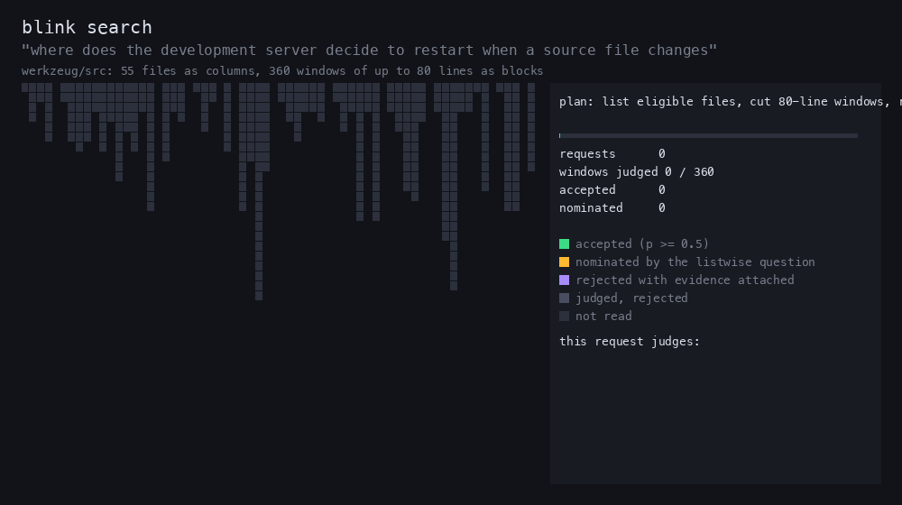

# Blink

Ask a codebase a question in plain English. Get back the exact source that answers it, in about two seconds.


Blink is a command-line code search for coding agents. It reads the working tree, splits files into windows, and asks the OpenAI Decisions API which windows implement the behavior in the question. It returns the matching source verbatim, with the path, line numbers, byte offsets and the file's SHA-256, so an agent can cite and verify what it read. There is no index to build and no background process.

## Why it exists

Agents spend most of a task finding the right code. Exact-text search needs the right identifier; reading files by hand burns context. The tools that answer behavioral questions well tend to take 15 to 20 seconds and 50 or more model calls per question, which is too slow inside an agent loop. Blink answers the same kind of question in about 2 seconds with 20 to 40 calls, stays quiet when the behavior does not exist, and never returns source it did not read byte for byte.

## Quick start

```sh
cargo install --git https://github.com/terkesi/blink --locked --bin blink
export OPENAI_API_KEY=...   # needs access to gpt-6-luna on /v1/decisions

blink files src --json                      # what a search would read
blink search "where does a timed-out job become eligible for retry" src
blink search "..." src --json               # for agents: results, coverage, budgets, errors
```

Rust 1.93 (pinned by the repository) on macOS or Linux. `blink doctor --json` reports whether the key is set; it never prints it. For agents, install the usage skill, which tells them how to scope a search and follow the evidence:

```sh
npx skills add terkesi/blink --skill blink
```

## What a search does



1. Lists eligible files under the root: UTF-8 text, `.gitignore` honoured, hidden, dependency, build and credential paths excluded.
2. On larger scopes, scores short previews of the repository's regions, then judges up to eight 80-line windows per request, each with its own yes-or-no question plus one listwise question ("which of these, if any, is the answer?").
3. Follows the evidence: windows that share identifiers with accepted code, the definitions that accepted code calls, a second look at near misses with all accepted excerpts attached, and the unread windows of implicated files (accepted ones, then those the model's scores, the call graph or the query's own words point at), nearest to their anchor first.
4. Rereads every accepted file and compares its hash before output, merges overlapping windows, and returns the best record per directory first.

By default fresh work is capped at 46 requests and 1,440 KiB of request bodies (48 and 1,568 KiB with retries) within 30 seconds, 16 requests at a time; most searches finish well inside that because the passes stop when there is nothing left worth reading. `--thorough` runs the same passes from a 64-request initial pass that reads scopes of up to 512 windows whole, with a ceiling of 150 requests and 4.9 MiB within 60 seconds. The exact passes, budgets and the JSON schema are in the [reference](docs/reference.md).

## Blink against the Reference CLI

Same questions, same checkouts, same scorer, both tools run back to back. A question counts as answered only when every required span is inside the returned source. Blink numbers are from the current build (`b62f6ac`); receipts, hashes and the status of every set are in [benchmarks](benchmarks/README.md).

| | Blink | Reference CLI | Ahead |
| --- | ---: | ---: | --- |
| **Finds every required span** | | | |
| 360 generated questions, three fresh sets (werkzeug, ripgrep) | **311** | 298 | Blink |
| 60 hand-written multi-span questions (five sealed sets, Python, Rust and TypeScript), default mode | 36 | **43** | Reference CLI |
| The same 60 questions, `--thorough` | **47** | 43 | Blink, 13 paired wins to 6 losses |
| Required spans found, hand-written (214), default / thorough | 174 / **196** | 192 | Blink in thorough mode |
| **Stays quiet when there is no answer** | | | |
| Source returned on 60 no-answer questions, hand-written, default / thorough | **10** / **12** | 42 | Blink |
| Source returned on 120 no-answer questions, generated | **9** | 16 | Blink |
| **Cost of one search (medians)** | | | |
| Wall time, default / thorough | **2.7 to 3.3 s** / **4.6 s** | 15 to 31 s | Blink, 5 to 6x |
| Slowest tenth of searches, default / thorough | **4 to 5 s** / **7 s** | 29 to 65 s | Blink |
| Model requests, default / thorough | **41 to 45** / 132 | 56 to 123 | Blink in default mode |
| Data sent to the model, default / thorough | **1.1 to 1.4 MB** / 3.0 MB | 1.5 to 3.5 MB | Blink in default mode |
| Failed searches (provider 503s) | 1 of 180 default, 1 of 60 thorough | 2 of 180 | level |

In default mode Blink finds more on generated questions (311 against 298, 36 paired wins to 23 losses) and less on hand-written multi-span questions (36 against 43 over five sealed sets). In `--thorough` mode, which runs the same passes from a 64-request first pass, it finds more than the Reference CLI on those hand-written questions too (47 against 43, 13 paired wins to 6 losses) at a third of the time, while spending more requests. Either way it returns source on no-answer questions a quarter as often. With an agent in the loop (Claude, one mandated search then free verification, 24 questions) the two tools were level at 6 of 12, with Blink's agent finishing in 25 s against 41 s. The [gate](benchmarks/README.md#the-gate) for releasing it to the team is a paired win on a fresh sealed set with no more no-answer sources, zero failures and half the cost; thorough mode met the first two clauses on the newest set and default mode has not yet.

## Limits

| | Default | `--thorough` |
| --- | --- | --- |
| Deadline | 30 s | 60 s |
| HTTP attempts, including retries | 48 | 150 |
| Request bodies | 1,568 KiB | 5,024 KiB |
| Concurrent requests | 16 | 16 |
| Records returned (`--limit`, up to 100) | 16 | 16 |
| Output | 64 KiB | 64 KiB |

Exit codes: 0 results or completed; 1 no matches after judging the whole scope; 2 invalid invocation or configuration; 3 failed or incomplete; 130 interrupted.

## What leaves your machine

The question, relative paths, region previews and the selected source windows go to OpenAI. Nothing else does. Choose the smallest useful root, and run `blink files ROOT` first to see exactly which files are eligible. The exclusion rules catch common secret files by name; they cannot detect a secret embedded in ordinary source.

## Develop

```sh
cargo fmt --check
cargo clippy --locked --all-targets -- -D warnings
cargo test --locked
scripts/verify --output /tmp/blink-proof
```

[verification.md](docs/verification.md) covers evaluation, benchmarks, proofs, fuzzing and native builds. [reference.md](docs/reference.md) covers search internals, the inventory policy, coverage semantics and the library API. `docs/demo.sh` records the terminal GIF (a real search; only the typing cadence is re-spaced), and `docs/algorithm-animation.py` draws the search animation from an `evaluate_case` receipt.
